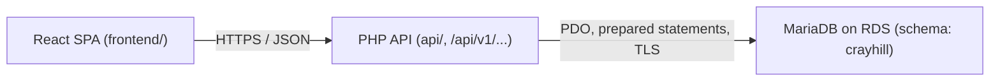
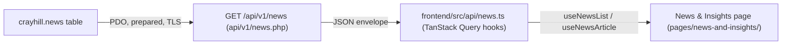
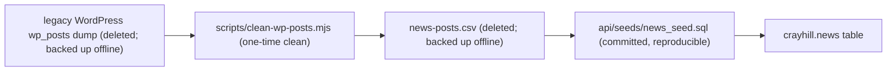
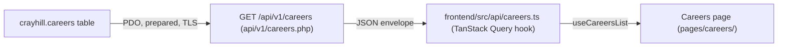
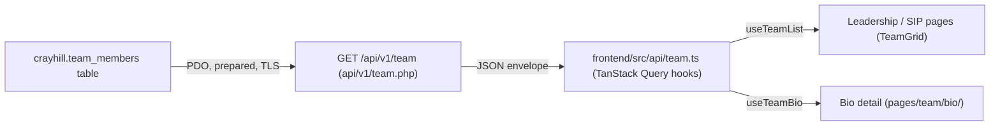
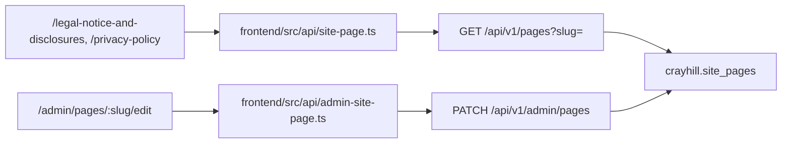
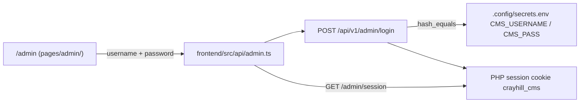
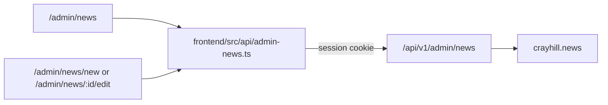
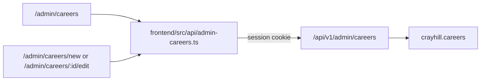

# Data Flow

How content moves through the Crayhill rebrand. This is a living document: it grows as content domains migrate from hardcoded files toward the database (and eventually an admin dashboard). See `.cursor/rules/50-living-docs.mdc` for the rules that keep it honest.

> **Status (current):** **News & Insights**, **Careers**, and **Legal / Privacy page copy** are database-backed end to end. Posts live in `news` (`GET /api/v1/news`), job postings in `careers` (`GET /api/v1/careers`), and fixed legal pages in `site_pages` (`GET /api/v1/pages?slug=<x>`). All three are editable via the CMS at `/admin`.

---

## System overview



Boundaries (from `.cursor/rules/00-project.mdc`): the SPA talks to the backend only through the typed API client; the API never returns raw DB rows; secrets and SQL never cross into `frontend/`.

---

## Current state vs. target state

| Domain | Current source | Target source | Migration trigger |
|---|---|---|---|
| News & Insights | **`news` table on RDS.** Public reads via `GET /api/v1/news`; CMS writes via authenticated `/api/v1/admin/news` (list, create, edit, status toggle, permanent delete). Seeded from [api/seeds/news_seed.sql](../api/seeds/news_seed.sql). | Same table with admin image uploads and audit trail **[planned]** | When image upload + audit ship |
| Careers | **`careers` table on RDS.** Public reads via `GET /api/v1/careers`; CMS writes via authenticated `/api/v1/admin/careers` (list, create, edit, status toggle, permanent delete). Seeded from [api/seeds/careers_seed.sql](../api/seeds/careers_seed.sql). | Same table with audit trail **[planned]** | When audit trail ships |
| Team | **`team_members` table on RDS.** Public reads via `GET /api/v1/team?roster=<roster>` (grid) and `GET /api/v1/team?roster=<roster>&slug=<x>` (bio); CMS writes via authenticated `/api/v1/admin/team` (separate list pages for Leadership and Senior Investment Professionals). Seeded from [api/seeds/team_members_data.php](../api/seeds/team_members_data.php) via [api/seeds/load_team_members.php](../api/seeds/load_team_members.php). | Same table with headshot upload + audit trail **[planned]** | When media library ships |
| Sectors | Hardcoded in [frontend/src/data/sectors.ts](../frontend/src/data/sectors.ts) | TBD - may stay static | Undecided |
| Page copy (legal / privacy) | **`site_pages` table on RDS.** Public reads via `GET /api/v1/pages?slug=<x>`; CMS edits via `/api/v1/admin/pages` (edit-only for seeded slugs). Seeded from [api/seeds/site_pages_seed.sql](../api/seeds/site_pages_seed.sql) (source Markdown in [api/seeds/content/](../api/seeds/content/)). | Same table with audit trail **[planned]** | When audit trail ships |

---

## News & Insights

The headline migration, now complete: the previous site's posts are data served through the API, not hand-maintained markup.

### Read flow (live)



- **Endpoint:** [api/v1/news.php](../api/v1/news.php) — list (`/api/v1/news`) and detail (`/api/v1/news?slug=<x>`). Returns only `status = 'published'` and `deleted_at IS NULL` rows, ordered `published_date DESC, id DESC`. Shaped into the standard envelope; never raw rows.
- **Client:** [frontend/src/api/news.ts](../frontend/src/api/news.ts) exposes `useNewsList()` and `useNewsArticle(slug)` over the typed fetch wrapper in [frontend/src/api/client.ts](../frontend/src/api/client.ts). Response types live in [frontend/src/api/types/news.ts](../frontend/src/api/types/news.ts) and mirror the PHP contract.
- **Page:** [frontend/src/pages/news-and-insights/](../frontend/src/pages/news-and-insights/) — the three newest posts render as featured cards (via the shared [NewsCard](../frontend/src/pages/news-and-insights/NewsCard.tsx)); the rest fill the "Crayhill in the News" list. The article detail page (`/news-and-insights/:slug`) renders the Markdown body in a two-column layout: the body on the left, plus a sidebar of the two most recent posts (`useNewsList()`, excluding the post being read) reusing the same `NewsCard`.
- **Homepage teaser:** the homepage "News & Insights" section ([frontend/src/pages/home/NewsInsights.tsx](../frontend/src/pages/home/NewsInsights.tsx)) also consumes `useNewsList()`, taking the three newest posts. It previously held hardcoded placeholder articles; that placeholder set has been removed, so the homepage now reflects the DB like the index page. On error or an empty list it degrades quietly (heading-only, no cards), since the heading links to the full index.

### Seed / provenance flow (one-time, historical)



1. **Origin:** a raw WordPress `wp_posts` dump (latin1, mojibake, Gutenberg/classic HTML, tracking links). Deleted from the repo once processed; backed up offline.
2. **Clean (one-time):** [scripts/clean-wp-posts.mjs](../scripts/clean-wp-posts.mjs) repaired encoding, stripped markup, converted bodies to Markdown, and unwrapped tracking links, emitting a `news-posts.csv` (since deleted; backed up offline).
3. **Committed seed:** [api/seeds/news_seed.sql](../api/seeds/news_seed.sql) is the repo's reproducible source for the table — a single idempotent `INSERT ... ON DUPLICATE KEY UPDATE` keyed on the unique `slug`. Loaded via the `mysql` client (not `migrate.php`, whose naive `;` splitter would shred the Markdown). See `INSTALL.md` → "Database setup".

The DB is now the source of truth for news content; editing happens directly in the table (and eventually via the admin dashboard), not by re-running a cleaner.

### `news` table

Defined by migration [api/migrations/2026_06_24_003_create_news.sql](../api/migrations/2026_06_24_003_create_news.sql).

| Column | Type | Notes |
|---|---|---|
| `id` | `BIGINT UNSIGNED` AUTO_INCREMENT | Surrogate PK. Legacy WP post IDs are discarded. |
| `title` | `VARCHAR(512)` | |
| `author` | `VARCHAR(255)` | Defaults to `Crayhill Capital Management` (the dump only stored WP user ID 1). |
| `slug` | `VARCHAR(255)` UNIQUE | Stable external identifier; the upsert key. Will form the `/news/<slug>` URL. |
| `published_date` | `DATE` | |
| `image` | `VARCHAR(512)` NULL | Root-relative path under `/images` once filled in (see Image flow). |
| `status` | `ENUM('published','draft')` | New rows default to `draft`; the legacy posts were loaded as `published`. Controls site visibility. |
| `content` | `LONGTEXT` | Markdown. |
| `created_at` / `updated_at` | `TIMESTAMP` | `updated_at` auto-updates on change. |
| `deleted_at` | `TIMESTAMP` NULL | Soft delete per `.cursor/rules/20-php-api.mdc`. |

Indexes: `UNIQUE (slug)`; `(status, published_date)` backs the "list published posts, newest first" query.

### API contract (live)

`GET /api/v1/news` — list of published posts, newest first:

```json
{ "data": [ { "id": 1, "slug": "…", "title": "…", "author": "…",
             "date": "2025-05-20", "image": null, "excerpt": "…" } ],
  "error": null, "meta": { "count": 25 } }
```

`GET /api/v1/news?slug=<slug>` — a single published post; `image` may be null, `content` is Markdown:

```json
{ "data": { "id": 1, "slug": "…", "title": "…", "author": "…",
            "date": "2025-05-20", "image": null, "content": "…markdown…" },
  "error": null, "meta": null }
```

`excerpt` is a plain-text summary the endpoint derives from the Markdown body so list cards never ship or parse the full content. Drafts and soft-deleted rows are never returned; an unknown/draft slug yields a `404` with a `NOT_FOUND` error envelope.

curl examples:

```bash
curl -s http://localhost:8000/v1/news.php
curl -s "http://localhost:8000/v1/news.php?slug=<slug>"
```

---

## Careers

The second DB-backed domain. The open job postings from the legacy crayhill.com Careers section are data served through the API. The rebuilt site has **no individual job-posting pages** — the Careers page (`/careers`) renders each posting as a clickable accordion (title → expand to full Markdown body), so the list endpoint returns the full body inline.

### Read flow (live)



- **Endpoint:** [api/v1/careers.php](../api/v1/careers.php) — list only (`/api/v1/careers`). Returns only `status = 'published'` and `deleted_at IS NULL` rows, ordered `sort_order ASC, id ASC`, with the full Markdown `content` inline. Shaped into the standard envelope; never raw rows.
- **Client:** [frontend/src/api/careers.ts](../frontend/src/api/careers.ts) exposes `useCareersList()` over the typed fetch wrapper in [frontend/src/api/client.ts](../frontend/src/api/client.ts). Response types live in [frontend/src/api/types/careers.ts](../frontend/src/api/types/careers.ts) and mirror the PHP contract.
- **Page:** [frontend/src/pages/careers/](../frontend/src/pages/careers/) — each posting is an accordion row; the title toggles its body open in place (rendered Markdown via `react-markdown` + `remark-gfm`). Per the designer spec, an expanded row turns the title + caret brand blue (`--color-accent`, `#57A0DD`) and rotates the caret. The nav and footer "Careers" links point at `/careers` (previously the dead `/team/careers`).

### Seed / provenance flow (one-time, historical)

The postings were scraped one-time from the legacy crayhill.com Careers listing and the individual job detail pages, converted to Markdown, and written to the committed, reproducible seed [api/seeds/careers_seed.sql](../api/seeds/careers_seed.sql) — a single idempotent `INSERT ... ON DUPLICATE KEY UPDATE` keyed on the unique `slug`. Loaded via the `mysql` client (not `migrate.php`, whose naive `;` splitter would shred the Markdown). The DB is now the source of truth; editing happens directly in the seed/table, not by re-scraping. (The Investment Analyst and Associate postings were initially seeded but later removed from both the seed and the live table — only the Data Center Project Development Manager role remains open. Note a seed re-run upserts the listed rows but does not delete rows dropped from the file, so removals are done with an explicit `DELETE`.)

### `careers` table

Defined by migration [api/migrations/2026_06_24_004_create_careers.sql](../api/migrations/2026_06_24_004_create_careers.sql).

| Column | Type | Notes |
|---|---|---|
| `id` | `BIGINT UNSIGNED` AUTO_INCREMENT | Surrogate PK. |
| `title` | `VARCHAR(255)` | Posting title (the accordion label). |
| `slug` | `VARCHAR(255)` UNIQUE | Stable external identifier; the upsert key. No public URL (no detail pages). |
| `location` | `VARCHAR(255)` NULL | Office location; not rendered on the page yet (design shows title + body only). |
| `sort_order` | `INT` | Ascending display order on the page; ties break on `id`. |
| `status` | `ENUM('published','draft')` | New rows default to `draft`; the live postings were loaded as `published`. Flip to `draft` to close a role without deleting it. |
| `content` | `LONGTEXT` | Markdown body. |
| `created_at` / `updated_at` | `TIMESTAMP` | `updated_at` auto-updates on change. |
| `deleted_at` | `TIMESTAMP` NULL | Soft delete per `.cursor/rules/20-php-api.mdc`. |

Indexes: `UNIQUE (slug)`; `(status, sort_order)` backs the "list published postings, in order" query.

### API contract (live)

`GET /api/v1/careers` — list of published postings, in display order; `content` is Markdown, `location` may be null:

```json
{ "data": [ { "id": 1, "slug": "data-center-project-development-manager",
             "title": "Data Center Project Development Manager",
             "location": null, "content": "…markdown…" } ],
  "error": null, "meta": { "count": 1 } }
```

Drafts and soft-deleted rows are never returned.

curl example:

```bash
curl -s http://localhost:8000/v1/careers.php
```

---

## Team (Leadership & Senior Investment Professionals)

The third DB-backed roster domain. Leadership and Senior Investment Professionals each have a public roster page (`/team/leadership`, `/team/senior-investment-professionals`) and shared bio detail routes (`/team/<roster>/<slug>`). Card titles on the grid may differ from full titles on the bio page (e.g. "Co-Founder" on the card vs "Managing Partner, Co-Founder" on the bio).

### Read flow (live)



- **Endpoint:** [api/v1/team.php](../api/v1/team.php) — roster list (`?roster=leadership` or `?roster=senior-investment-professionals`) returns published grid cards (`slug`, `name`, `title`, `imageSrc`); bio detail adds `?slug=<x>` and returns the full Markdown body plus contact fields. Only `status = 'published'` and `deleted_at IS NULL` rows are returned.
- **Client:** [frontend/src/api/team.ts](../frontend/src/api/team.ts) exposes `useTeamList(roster)` and `useTeamBio(roster, slug)`. Types in [frontend/src/api/types/team.ts](../frontend/src/api/types/team.ts).
- **Pages:** [frontend/src/pages/team/leadership/](../frontend/src/pages/team/leadership/), [frontend/src/pages/team/senior-investment-professionals/](../frontend/src/pages/team/senior-investment-professionals/), and the shared [frontend/src/pages/team/bio/](../frontend/src/pages/team/bio/) detail view. Bio body renders via [TeamBioMarkdownBody](../frontend/src/components/TeamBioMarkdownBody.tsx) (multi-column paragraph flow).

### Admin flow (live)

Two CMS list pages under `/admin/team/leadership` and `/admin/team/senior-investment-professionals`, each with create/edit forms. Authenticated CRUD via [api/v1/admin/team.php](../api/v1/admin/team.php); frontend hooks in [frontend/src/api/admin-team.ts](../frontend/src/api/admin-team.ts).

### Seed / provenance

Initial rows were exported from the former hardcoded roster pages and bio copy into [api/seeds/team_members_data.php](../api/seeds/team_members_data.php). Load via:

```sh
php api/seeds/load_team_members.php
```

Idempotent upsert on unique `slug`. The DB is the source of truth after first load; edit via the CMS or the seed file.

### `team_members` table

Defined by migration [api/migrations/2026_06_25_006_create_team_members.sql](../api/migrations/2026_06_25_006_create_team_members.sql).

| Column | Type | Notes |
|---|---|---|
| `id` | `BIGINT UNSIGNED` AUTO_INCREMENT | Surrogate PK. |
| `slug` | `VARCHAR(255)` UNIQUE | Stable identifier; used in public bio URLs. |
| `name` | `VARCHAR(255)` | Display name (H2 on bio, H3 on card). |
| `card_title` | `VARCHAR(255)` | Short title on the roster grid (H5). |
| `full_title` | `VARCHAR(512)` | Longer title on the bio detail page (H5). |
| `image_src` | `VARCHAR(512)` | Root-relative headshot path under `/images/`. |
| `email` | `VARCHAR(255)` NULL | Optional; renders mailto icon on bio. |
| `linkedin_url` | `VARCHAR(512)` NULL | Optional; renders LinkedIn icon on bio. |
| `roster` | `ENUM('leadership','senior-investment-professionals')` | Which public roster page the member belongs to. |
| `sort_order` | `INT` | Ascending display order within the roster. |
| `status` | `ENUM('published','draft')` | Draft rows are CMS-only. |
| `content` | `LONGTEXT` | Markdown bio body (paragraphs separated by blank lines). |
| `created_at` / `updated_at` | `TIMESTAMP` | `updated_at` auto-updates on change. |
| `deleted_at` | `TIMESTAMP` NULL | Soft delete. |

Indexes: `UNIQUE (slug)`; `(roster, status, sort_order)` backs the published roster query.

### API contract (live)

Roster list:

```json
{ "data": [ { "slug": "josh-eaton", "name": "Josh Eaton",
             "title": "Co-Founder", "imageSrc": "/images/headshot-josh.jpg" } ],
  "error": null, "meta": { "count": 6, "roster": "leadership" } }
```

Bio detail (`?roster=leadership&slug=josh-eaton`):

```json
{ "data": { "slug": "josh-eaton", "name": "Josh Eaton",
            "fullTitle": "Managing Partner, Co-Founder",
            "imageSrc": "/images/headshot-josh.jpg",
            "email": "josh.eaton@crayhillcapital.com",
            "linkedinUrl": "https://www.linkedin.com/in/josh-eaton/",
            "content": "…markdown…",
            "rosterPath": "/team/leadership", "roster": "leadership" },
  "error": null, "meta": null }
```

curl examples:

```bash
curl -s 'http://localhost:8000/v1/team.php?roster=leadership'
curl -s 'http://localhost:8000/v1/team.php?roster=leadership&slug=josh-eaton'
```

---

## Site pages (Legal Notice & Privacy Policy)

Fixed-route marketing/legal pages share one table. Each row is keyed by `slug` (matching the public URL segment). There are no individual CMS create/delete operations — pages are provisioned via migration + seed; operators edit copy in place.



- **Migration:** [api/migrations/2026_06_24_005_create_site_pages.sql](../api/migrations/2026_06_24_005_create_site_pages.sql)
- **Seed:** [api/seeds/site_pages_seed.sql](../api/seeds/site_pages_seed.sql) — readable source Markdown in [api/seeds/content/](../api/seeds/content/). Load via `mysql` client after migration `005`.
- **Public endpoint:** [api/v1/pages.php](../api/v1/pages.php) — returns published rows only.
- **Admin endpoint:** [api/v1/admin/pages.php](../api/v1/admin/pages.php) — list + edit; slug allowlist in [api/lib/site_pages.php](../api/lib/site_pages.php).
- **Public pages:** [frontend/src/components/SitePageView.tsx](../frontend/src/components/SitePageView.tsx) — shared layout; Markdown via [LegalMarkdownBody](../frontend/src/components/LegalMarkdownBody.tsx) (`.legal-prose`, internal links as React Router `Link`).
- **CMS:** [frontend/src/pages/admin/pages/](../frontend/src/pages/admin/pages/) — index at `/admin/pages`; separate sidebar entries link directly to each editor. Uses [MarkdownEditorWithPreview](../frontend/src/components/MarkdownEditorWithPreview.tsx) with `previewVariant="legal"`.

Allowed slugs (must stay in sync across PHP, seed, and [frontend/src/lib/site-page-slugs.ts](../frontend/src/lib/site-page-slugs.ts)):

| Slug | Public route |
|---|---|
| `legal-notice-and-disclosures` | `/legal-notice-and-disclosures` |
| `privacy-policy` | `/privacy-policy` |

---

## Image and asset flow

Brand assets are served statically today: files in `assets/` at the repo root are copied verbatim into the build by Vite's `publicDir` and referenced by root-relative URL (`/images/...`). See `INSTALL.md` -> "Static assets".

For news, the `news.image` column holds such a root-relative path (e.g. `/images/news-fund-iii.jpg`). It is currently `null` for every imported legacy post, so the News & Insights cards resolve an image client-side from the published date (see [frontend/src/lib/news-image.ts](../frontend/src/lib/news-image.ts)): a post dated `YYYY-MM-DD` pairs to `/images/article-YYYY-MM.jpg`, posts older than two years show a neutral "No image" placeholder (designer policy), and a non-`null` `image` on the row always wins. The `AVAILABLE_ARTICLE_IMAGES` set in that file lists the curated files currently in `assets/images` and is a guard against broken `` tags — it goes away once images are managed in the DB. **[planned]** admin-managed uploads (S3 or a non-tracked EC2 dir, referenced by URL in the DB) are the longer-term direction and are the primary motivator for the admin dashboard.

---

## Forms / writes

### CMS admin sign-in (phase 1 — live)



- **Page:** [frontend/src/pages/admin/](../frontend/src/pages/admin/) — outside the public `RootLayout` (no marketing nav/footer). Renders a sign-in form until `GET /api/v1/admin/session` reports `authenticated: true`.
- **Credentials:** `CMS_USERNAME` and `CMS_PASS` in `.config/secrets.env` (see `.config/secrets.env.example`). Not stored in the database in phase 1.
- **Endpoints:** [api/v1/admin/login.php](../api/v1/admin/login.php), [session.php](../api/v1/admin/session.php), [logout.php](../api/v1/admin/logout.php). Session helpers live in [api/lib/session.php](../api/lib/session.php).
- **Client:** [frontend/src/api/admin.ts](../frontend/src/api/admin.ts) — `useAdminSession`, `useAdminLogin`, `useAdminLogout`. All API calls send `credentials: 'include'` so the HttpOnly cookie round-trips.

No public write endpoints exist yet. Contact/subscribe forms described in `.cursor/rules/20-php-api.mdc` are not built.

### CMS news management (live)



- **Pages:** [frontend/src/pages/admin/news/](../frontend/src/pages/admin/news/) — list table with inline status changes, two-step permanent delete, and create/edit forms.
- **Client:** [frontend/src/api/admin-news.ts](../frontend/src/api/admin-news.ts) — `useAdminNewsList`, `useAdminNewsArticle`, create/update/delete mutations. Types in [frontend/src/api/types/admin-news.ts](../frontend/src/api/types/admin-news.ts).
- **Endpoint:** [api/v1/admin/news.php](../api/v1/admin/news.php) — authenticated CRUD guarded by `cms_require_auth()`. Returns drafts and published posts; deletes are hard deletes (row removed from `news`).
- **Shared helpers:** [api/lib/news.php](../api/lib/news.php) — excerpt generation and response shaping used by both the public and admin endpoints.

### CMS careers management (live)



- **Pages:** [frontend/src/pages/admin/careers/](../frontend/src/pages/admin/careers/) — list table with inline status changes, two-step permanent delete, and create/edit forms. Uses the shared [MarkdownEditorWithPreview](../frontend/src/components/MarkdownEditorWithPreview.tsx) with `previewVariant="careers"`.
- **Client:** [frontend/src/api/admin-careers.ts](../frontend/src/api/admin-careers.ts) — `useAdminCareersList`, `useAdminCareersPosting`, create/update/delete mutations. Types in [frontend/src/api/types/admin-careers.ts](../frontend/src/api/types/admin-careers.ts).
- **Endpoint:** [api/v1/admin/careers.php](../api/v1/admin/careers.php) — authenticated CRUD guarded by `cms_require_auth()`. Ordered by `sort_order`; deletes are hard deletes.
- **Shared helpers:** [api/lib/careers.php](../api/lib/careers.php) — response shaping and validation used by both the public and admin endpoints.

### CMS site pages (live)

- **Pages:** [frontend/src/pages/admin/pages/](../frontend/src/pages/admin/pages/) — edit-only tooling for seeded legal/privacy copy. Sidebar links go directly to each editor; `/admin/pages` lists all provisioned pages.
- **Client:** [frontend/src/api/admin-site-page.ts](../frontend/src/api/admin-site-page.ts)
- **Endpoint:** [api/v1/admin/pages.php](../api/v1/admin/pages.php)

---

## Admin dashboard

**Phase 1 (live):** `/admin` sign-in plus CMS tooling for news, careers, legal/privacy page copy, and team rosters (Leadership + Senior Investment Professionals as separate admin pages).

**Planned next:** headshot uploads via media library and an audit trail.
