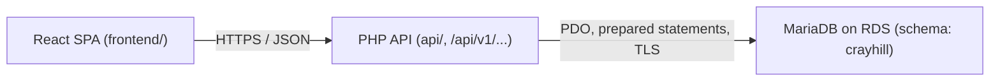
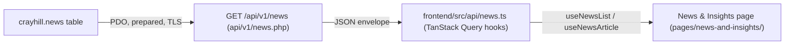
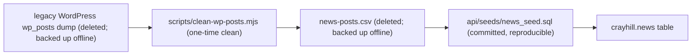
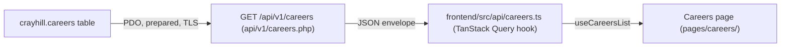

# Data Flow

How content moves through the Crayhill rebrand. This is a living document: it grows as content domains migrate from hardcoded files toward the database (and eventually an admin dashboard). See `.cursor/rules/50-living-docs.mdc` for the rules that keep it honest.

> **Status (current):** The site is mostly static, with two domains now fully database-backed end to end: **News & Insights** and **Careers**. The cleaned legacy WordPress posts live in a `news` table on RDS (served via `GET /api/v1/news`), and the open job postings live in a `careers` table (served via `GET /api/v1/careers`). These are the content domains that have completed the hardcoded → DB-driven migration (the "headline event" in `50-living-docs.mdc`).

---

## System overview



Boundaries (from `.cursor/rules/00-project.mdc`): the SPA talks to the backend only through the typed API client; the API never returns raw DB rows; secrets and SQL never cross into `frontend/`.

---

## Current state vs. target state

| Domain | Current source | Target source | Migration trigger |
|---|---|---|---|
| News & Insights | **`news` table on RDS, served via `GET /api/v1/news`** and consumed by the React app through the typed API client. Seeded from [api/seeds/news_seed.sql](../api/seeds/news_seed.sql). | Admin-dashboard-managed `news` table (same endpoint, editable content + image uploads) **[planned]** | When the admin dashboard ships |
| Careers | **`careers` table on RDS, served via `GET /api/v1/careers`** and consumed by the React app through the typed API client. Seeded from [api/seeds/careers_seed.sql](../api/seeds/careers_seed.sql). | Admin-dashboard-managed `careers` table (same endpoint, editable postings, flip `status` to open/close a role) **[planned]** | When the admin dashboard ships |
| Team | Hardcoded in [frontend/src/data/team-bios.ts](../frontend/src/data/team-bios.ts) | `GET /api/v1/team` backed by a `team` table **[planned]** | When the admin dashboard ships |
| Sectors | Hardcoded in [frontend/src/data/sectors.ts](../frontend/src/data/sectors.ts) | TBD - may stay static | Undecided |
| Page copy | Inline in page components under `frontend/src/pages/` | TBD | Undecided |

---

## News & Insights

The headline migration, now complete: the previous site's posts are data served through the API, not hand-maintained markup.

### Read flow (live)



- **Endpoint:** [api/v1/news.php](../api/v1/news.php) — list (`/api/v1/news`) and detail (`/api/v1/news?slug=<x>`). Returns only `status = 'published'` and `deleted_at IS NULL` rows, ordered `published_date DESC, id DESC`. Shaped into the standard envelope; never raw rows.
- **Client:** [frontend/src/api/news.ts](../frontend/src/api/news.ts) exposes `useNewsList()` and `useNewsArticle(slug)` over the typed fetch wrapper in [frontend/src/api/client.ts](../frontend/src/api/client.ts). Response types live in [frontend/src/api/types/news.ts](../frontend/src/api/types/news.ts) and mirror the PHP contract.
- **Page:** [frontend/src/pages/news-and-insights/](../frontend/src/pages/news-and-insights/) — the three newest posts render as featured cards (via the shared [NewsCard](../frontend/src/pages/news-and-insights/NewsCard.tsx)); the rest fill the "Crayhill in the News" list. The article detail page (`/news-and-insights/:slug`) renders the Markdown body in a two-column layout: the body on the left, plus a sidebar of the two most recent posts (`useNewsList()`, excluding the post being read) reusing the same `NewsCard`.
- **Homepage teaser:** the homepage "News & Insights" section ([frontend/src/pages/home/NewsInsights.tsx](../frontend/src/pages/home/NewsInsights.tsx)) also consumes `useNewsList()`, taking the three newest posts. It previously held hardcoded placeholder articles; that placeholder set has been removed, so the homepage now reflects the DB like the index page. On error or an empty list it degrades quietly (heading-only, no cards), since the heading links to the full index.

### Seed / provenance flow (one-time, historical)



1. **Origin:** a raw WordPress `wp_posts` dump (latin1, mojibake, Gutenberg/classic HTML, tracking links). Deleted from the repo once processed; backed up offline.
2. **Clean (one-time):** [scripts/clean-wp-posts.mjs](../scripts/clean-wp-posts.mjs) repaired encoding, stripped markup, converted bodies to Markdown, and unwrapped tracking links, emitting a `news-posts.csv` (since deleted; backed up offline).
3. **Committed seed:** [api/seeds/news_seed.sql](../api/seeds/news_seed.sql) is the repo's reproducible source for the table — a single idempotent `INSERT ... ON DUPLICATE KEY UPDATE` keyed on the unique `slug`. Loaded via the `mysql` client (not `migrate.php`, whose naive `;` splitter would shred the Markdown). See `INSTALL.md` → "Database setup".

The DB is now the source of truth for news content; editing happens directly in the table (and eventually via the admin dashboard), not by re-running a cleaner.

### `news` table

Defined by migration [api/migrations/2026_06_24_003_create_news.sql](../api/migrations/2026_06_24_003_create_news.sql).

| Column | Type | Notes |
|---|---|---|
| `id` | `BIGINT UNSIGNED` AUTO_INCREMENT | Surrogate PK. Legacy WP post IDs are discarded. |
| `title` | `VARCHAR(512)` | |
| `author` | `VARCHAR(255)` | Defaults to `Crayhill Capital Management` (the dump only stored WP user ID 1). |
| `slug` | `VARCHAR(255)` UNIQUE | Stable external identifier; the upsert key. Will form the `/news/<slug>` URL. |
| `published_date` | `DATE` | |
| `image` | `VARCHAR(512)` NULL | Root-relative path under `/images` once filled in (see Image flow). |
| `status` | `ENUM('published','draft')` | New rows default to `draft`; the legacy posts were loaded as `published`. Controls site visibility. |
| `content` | `LONGTEXT` | Markdown. |
| `created_at` / `updated_at` | `TIMESTAMP` | `updated_at` auto-updates on change. |
| `deleted_at` | `TIMESTAMP` NULL | Soft delete per `.cursor/rules/20-php-api.mdc`. |

Indexes: `UNIQUE (slug)`; `(status, published_date)` backs the "list published posts, newest first" query.

### API contract (live)

`GET /api/v1/news` — list of published posts, newest first:

```json
{ "data": [ { "id": 1, "slug": "…", "title": "…", "author": "…",
             "date": "2025-05-20", "image": null, "excerpt": "…" } ],
  "error": null, "meta": { "count": 25 } }
```

`GET /api/v1/news?slug=<slug>` — a single published post; `image` may be null, `content` is Markdown:

```json
{ "data": { "id": 1, "slug": "…", "title": "…", "author": "…",
            "date": "2025-05-20", "image": null, "content": "…markdown…" },
  "error": null, "meta": null }
```

`excerpt` is a plain-text summary the endpoint derives from the Markdown body so list cards never ship or parse the full content. Drafts and soft-deleted rows are never returned; an unknown/draft slug yields a `404` with a `NOT_FOUND` error envelope.

curl examples:

```bash
curl -s http://localhost:8000/v1/news.php
curl -s "http://localhost:8000/v1/news.php?slug=<slug>"
```

---

## Careers

The second DB-backed domain. The open job postings from the legacy crayhill.com Careers section are data served through the API. The rebuilt site has **no individual job-posting pages** — the Careers page (`/careers`) renders each posting as a clickable accordion (title → expand to full Markdown body), so the list endpoint returns the full body inline.

### Read flow (live)



- **Endpoint:** [api/v1/careers.php](../api/v1/careers.php) — list only (`/api/v1/careers`). Returns only `status = 'published'` and `deleted_at IS NULL` rows, ordered `sort_order ASC, id ASC`, with the full Markdown `content` inline. Shaped into the standard envelope; never raw rows.
- **Client:** [frontend/src/api/careers.ts](../frontend/src/api/careers.ts) exposes `useCareersList()` over the typed fetch wrapper in [frontend/src/api/client.ts](../frontend/src/api/client.ts). Response types live in [frontend/src/api/types/careers.ts](../frontend/src/api/types/careers.ts) and mirror the PHP contract.
- **Page:** [frontend/src/pages/careers/](../frontend/src/pages/careers/) — each posting is an accordion row; the title toggles its body open in place (rendered Markdown via `react-markdown` + `remark-gfm`). Per the designer spec, an expanded row turns the title + caret brand blue (`--color-accent`, `#57A0DD`) and rotates the caret. The nav and footer "Careers" links point at `/careers` (previously the dead `/team/careers`).

### Seed / provenance flow (one-time, historical)

The postings were scraped one-time from the legacy crayhill.com Careers listing and the individual job detail pages, converted to Markdown, and written to the committed, reproducible seed [api/seeds/careers_seed.sql](../api/seeds/careers_seed.sql) — a single idempotent `INSERT ... ON DUPLICATE KEY UPDATE` keyed on the unique `slug`. Loaded via the `mysql` client (not `migrate.php`, whose naive `;` splitter would shred the Markdown). The DB is now the source of truth; editing happens directly in the seed/table, not by re-scraping. (The Investment Analyst and Associate postings were initially seeded but later removed from both the seed and the live table — only the Data Center Project Development Manager role remains open. Note a seed re-run upserts the listed rows but does not delete rows dropped from the file, so removals are done with an explicit `DELETE`.)

### `careers` table

Defined by migration [api/migrations/2026_06_24_004_create_careers.sql](../api/migrations/2026_06_24_004_create_careers.sql).

| Column | Type | Notes |
|---|---|---|
| `id` | `BIGINT UNSIGNED` AUTO_INCREMENT | Surrogate PK. |
| `title` | `VARCHAR(255)` | Posting title (the accordion label). |
| `slug` | `VARCHAR(255)` UNIQUE | Stable external identifier; the upsert key. No public URL (no detail pages). |
| `location` | `VARCHAR(255)` NULL | Office location; not rendered on the page yet (design shows title + body only). |
| `sort_order` | `INT` | Ascending display order on the page; ties break on `id`. |
| `status` | `ENUM('published','draft')` | New rows default to `draft`; the live postings were loaded as `published`. Flip to `draft` to close a role without deleting it. |
| `content` | `LONGTEXT` | Markdown body. |
| `created_at` / `updated_at` | `TIMESTAMP` | `updated_at` auto-updates on change. |
| `deleted_at` | `TIMESTAMP` NULL | Soft delete per `.cursor/rules/20-php-api.mdc`. |

Indexes: `UNIQUE (slug)`; `(status, sort_order)` backs the "list published postings, in order" query.

### API contract (live)

`GET /api/v1/careers` — list of published postings, in display order; `content` is Markdown, `location` may be null:

```json
{ "data": [ { "id": 1, "slug": "data-center-project-development-manager",
             "title": "Data Center Project Development Manager",
             "location": null, "content": "…markdown…" } ],
  "error": null, "meta": { "count": 1 } }
```

Drafts and soft-deleted rows are never returned.

curl example:

```bash
curl -s http://localhost:8000/v1/careers.php
```

---

## Image and asset flow

Brand assets are served statically today: files in `assets/` at the repo root are copied verbatim into the build by Vite's `publicDir` and referenced by root-relative URL (`/images/...`). See `INSTALL.md` -> "Static assets".

For news, the `news.image` column holds such a root-relative path (e.g. `/images/news-fund-iii.jpg`). It is currently `null` for every imported legacy post, so the News & Insights cards resolve an image client-side from the published date (see [frontend/src/lib/news-image.ts](../frontend/src/lib/news-image.ts)): a post dated `YYYY-MM-DD` pairs to `/images/article-YYYY-MM.jpg`, posts older than two years show a neutral "No image" placeholder (designer policy), and a non-`null` `image` on the row always wins. The `AVAILABLE_ARTICLE_IMAGES` set in that file lists the curated files currently in `assets/images` and is a guard against broken `` tags — it goes away once images are managed in the DB. **[planned]** admin-managed uploads (S3 or a non-tracked EC2 dir, referenced by URL in the DB) are the longer-term direction and are the primary motivator for the admin dashboard.

---

## Forms / writes

*(None yet.)* No write endpoints exist. The contact/subscribe forms described in `.cursor/rules/20-php-api.mdc` are not built.

---

## Admin dashboard **[planned]**

Not started. The intended purpose is letting non-developers edit news, swap images, and flip `status` without a code commit. Auth, content lists, edit screens, and an audit trail will be documented here as each phase lands.
